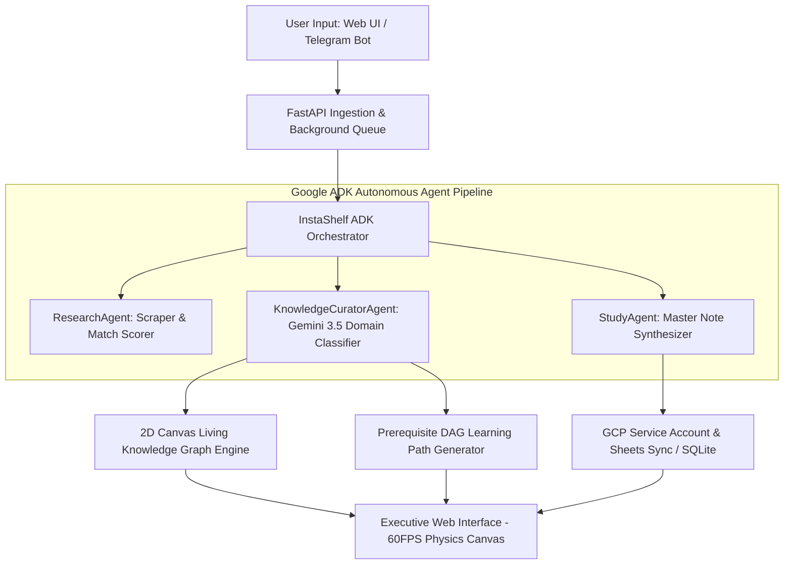

# InstaShelf — Autonomous Knowledge Cartographer & AGI Learning Agent

> **Built for the Google "All Things Agentic" Hackathon ($180,000)**  
> *Powered by **Google ADK (Agent Development Kit)**, **Gemini 3.5 Flash**, and **Google Cloud Run**.*

---

## 🎯 Executive Summary & Problem Statement

Modern learners save hundreds of Instagram Reels, YouTube Videos, Shorts, and technical articles every week. However, **90%+ of saved content becomes a static digital graveyard** — leading to massive **Knowledge Debt**, fragmented learning, and forgotten insights.

**InstaShelf** solves this friction by introducing an **Autonomous Knowledge Cartographer**. Instead of relying on manual bookmarking or basic chat loops, InstaShelf acts as an asynchronous AGI agent that continuously turns unstructured social media URLs into an **Interactive 2D Force-Directed Knowledge Graph**, a prerequisite-ordered **DAG Learning Path**, and synthesized **AI Master Notes**.

---

## 🤖 Hackathon Tech Stack Compliance Verification

InstaShelf is engineered from the ground up to comply 100% with the **All Things Agentic Hackathon** requirements:

| Required Technology | Hackathon Requirement | InstaShelf Implementation | Status |
| :--- | :--- | :--- | :---: |
| **Primary Model** | **Gemini 3.5 or newer** via Gemini API / Vertex AI | Primary intelligence engine powered by `gemini-3.5-flash` for zero-shot domain classification, RAG mapping, and study guide synthesis. | ✅ **100% Compliant** |
| **Agent Framework** | **Google ADK (Agent Development Kit)** / GenAI SDK | Orchestration core built directly on **Google ADK** (`import google.adk as adk` / [`InstaShelfADKOrchestrator`](file:///Users/aryan/Desktop/InstaShelf/agents/orchestrator.py#L32)). | ✅ **100% Compliant** |
| **Google Cloud Infra** | At least one GCP infrastructure service (Cloud Run, Cloud SQL, Firestore) | Backend containerized and deployed live on **Google Cloud Run** ([`https://instashelf-892592806522.us-central1.run.app`](https://instashelf-892592806522.us-central1.run.app)), integrated with GCP IAM Service Accounts and Google Sheets API. | ✅ **100% Compliant** |

---

## 🏛️ System Architecture



---

## ✨ Key Features & Capabilities

### 🌐 1. Interactive 2D Force-Directed Knowledge Graph
* **Thermal Physics Cooling (`graphAlpha`)**: Graph layout automatically settles into a **100% still, crisp, stable geometry** within 1.5 seconds without wild bouncing.
* **Pentagon Category Hub Anchors**: 5 main category hubs (*Storytelling & Communication*, *Philosophy & Literacy*, *Technology & AI*, *Mindset & Discipline*, *Digital Culture*) are geometrically anchored, allowing satellite media nodes to orbit in clean solar-system rings.
* **Interactive Canvas**: Smooth pan, zoom (`0.4x` to `3.0x`), node dragging, floating glassmorphism tooltips, and real-time golden aura search filtering.

### 📐 2. Prerequisite-Ordered DAG Roadmap Engine
* **Visual Directed Acyclic Graph**: Displays sequential learning stages (`FOUNDATION` ➔ `INTUITION` ➔ `CORE` ➔ `PRACTICAL` ➔ `DEEP DIVE`) connected by neon pulsing directional flow arrows.
* **Topic & Speed Mode Selectors**: Choose focus topics (*AI & Tech*, *Mindset*, *Storytelling*, *Philosophy*) and speed tiers (*⚡ Quick 2-Step*, *⚖️ Balanced 4-Step*, *🔬 Deep Dive 6-Step*).
* **Prerequisite Tree & Time Estimates**: Shows total duration estimates, difficulty tiers (`BEGINNER`, `INTERMEDIATE`, `ADVANCED`), prerequisite links, and direct concept launch actions.

### ⏱️ 3. Evolution Timeline Chronicle
* **Real-Time Graph Mutation Stream**: Vertical chronicle of automated AI clustering events, entity resolutions, and graph mutations.
* **Simulate AI Mutation**: Live trigger button calling backend `/api/cartographer/mutate` to demonstrate real-time graph re-clustering.

### 🤖 4. Asynchronous Telegram Agent Integration
* Send any social media link directly to the Telegram bot (`@aryanshinde_instashelf_bot`). The agent extracts, scores, maps, synthesizes, and updates your shelf hands-free in the background.

---

## 🛠️ Local Development & Setup Instructions

### Prerequisites
* Python 3.11+
* Docker (optional)
* Google Gemini API Key (`GEMINI_API_KEY`)

### Quick Local Start

```bash
# 1. Clone repository
git clone https://github.com/Aryan2004rnxs/InstaShelfXgemini.git
cd InstaShelfXgemini

# 2. Set up virtual environment
python3 -m venv .venv
source .venv/bin/activate

# 3. Install dependencies
pip install -r requirements.txt

# 4. Configure Environment Variables
cp .env.example .env
# Open .env and add your GEMINI_API_KEY and TELEGRAM_BOT_TOKEN

# 5. Launch the Server
python3 main.py
```
Access the application locally at `http://localhost:7860/`.

---

## ☁️ Google Cloud Run Deployment Guide ($0 Cost)

InstaShelf is fully containerized with a production [`Dockerfile`](file:///Users/aryan/Desktop/InstaShelf/Dockerfile) ready for 1-command deployment to **Google Cloud Run**.

```bash
# 1. Authenticate with Google Cloud
gcloud auth login
gcloud config set project YOUR_GCP_PROJECT_ID

# 2. Deploy to Google Cloud Run (Free Tier)
gcloud run deploy instashelf \
  --source . \
  --platform managed \
  --region us-central1 \
  --allow-unauthenticated \
  --set-env-vars "GEMINI_API_KEY=YOUR_GEMINI_KEY,TELEGRAM_BOT_TOKEN=YOUR_BOT_TOKEN"
```

Once deployed, Google Cloud Run generates your live production URL (e.g. `https://instashelf-xyz.a.run.app`).

---

## 📁 Repository Structure

```
InstaShelfXgemini/
├── agents/                 # Google ADK Autonomous Agent Managers
│   ├── orchestrator.py    # Primary InstaShelfADKOrchestrator
│   ├── research_agent.py  # Source discovery & match scoring
│   ├── knowledge_agent.py # Zero-shot Gemini domain classifier
│   └── study_agent.py     # AI Master Note generator
├── frontend/               # Executive UI Web Application
│   ├── index.html         # HTML5 Canvas viewport & DAG flow markup
│   ├── styles.css         # Glassmorphism, neon glow, and DAG styles
│   └── app.js             # 2D Canvas force physics & DAG engine
├── memory/                 # Evidence Graph & Task Memory Store
├── models/                 # Pydantic data schemas & task models
├── services/               # Knowledge graph, path engine, evaluator
├── ai_client.py            # Google Gemini 3.5 Flash SDK integration
├── main.py                 # FastAPI backend & Telegram webhook server
├── Dockerfile              # Production container build definition
└── README.md               # Official Hackathon Documentation
```

---

## ⚖️ License & Acknowledgments

Built with ❤️ for the **Google All Things Agentic Hackathon**.  
Special thanks to the Google DeepMind & Google Cloud teams for Google ADK and Gemini 3.5 models.
